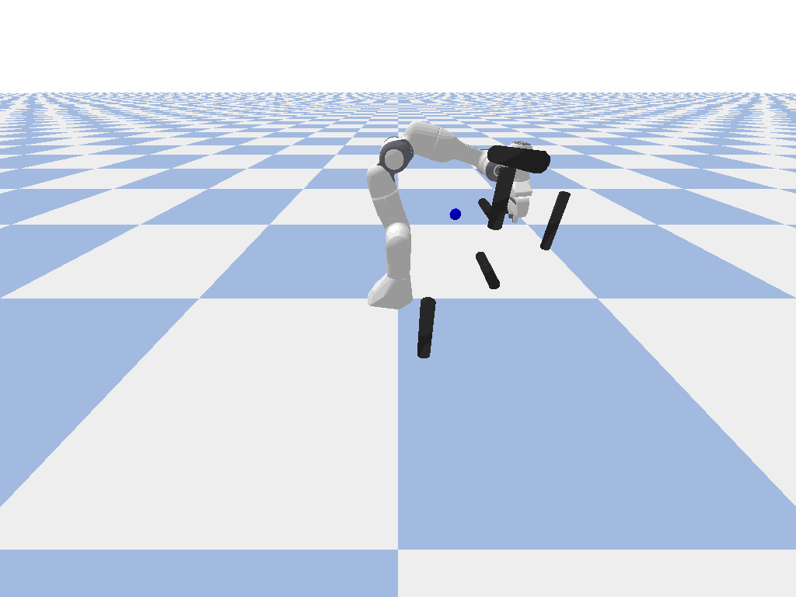

- Подумал, что стоит описывать, что делаю вообще.
- Пытался запустить какую-нибудь из уже готовых симуляций [[Статья RMP]].
- На выбор нашел #Симуляция
	- [официальный вариант от Nvidia](https://docs.isaacsim.omniverse.nvidia.com/latest/manipulators/concepts/rmpflow.html), который надо запускать в Isaac Sim. Пока не хочу запариваться и работать на других компах.
	  logseq.order-list-type:: number
	- [какая-то имплементация с гитхаба](https://github.com/TomGoesGitHub/Riemannian-Motion-Policies), которая запускается через pyBullet.
	  logseq.order-list-type:: number
	- [optimization fabrics](https://github.com/tud-amr/fabrics). По факту не совсем RMP, так как основана уже на более крутой и сложной идее с [[Многообразия Финслера]]. Но, думаю, что можно переработать в RMP, так как важна именно база работы с пространством, метриками и самой  политикой. Более того, содержит блокнотики к идеям из различных связанных статей.
	  logseq.order-list-type:: number
	- [какая-то реализация для движения нескольких роботов в 2D](https://github.com/gtrll/multi-robot-rmpflow). Не очень подходит, но можно посмотреть, как реализовано.
	  logseq.order-list-type:: number
- Пока остановился на 2. Получилось позапускать что-то, но смотреть в лайве невозможно, так как используемый `tensorflow` на моем компе без видеокарты очень медленно считает все. Однако есть гифочки, который он сохраняет в результате. Некоторое поведение кажется немного странным.
	- Просто движение до цели 
	- Не дождался, когда дойдет до точки 
	- Есть для планарного (чуть бракованное, правда) 