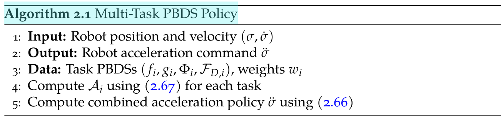
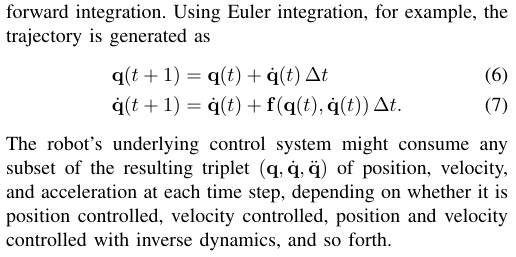

- {{embed [[@Leveraging the geometric structure of robotic tasks for motion design]]}}
- # #Заметки
	- Идея фактически в том, чтобы построить оптимальный путь в операционном пространстве, а затем, используя _pullback_, "стянуть" его в конфигурационное пространство.
	- Предлагается разделить задания на притяжение (attraction), демпирование (damping) и обход препятствий (obstacle avoidance). Для каждого из этих заданий предлагаются примеры метрики, диссипативных сил и потенциального поля. При этом на самом деле под каждое задание определяется только одно из этих вещей, остальные при этом становятся тривиальными (нулевыми или тождественными).
	- Из вида предложенного алгоритма  видно, что предложенный метод принимает на вход положения и скорости сочленений и выдает ускорения на них.
	- Gap, который пытаются покрыть новым алгоритмом:
	  > To summarize, a large gap remains for producing a fast, easy-to-use, and geometrically-consistent approach for generating motion policies on general robot and task manifolds, achieving velocity-dependent task-weighting, and leveraging metric-based enforcement of constraints to eliminate unwanted potential function local minima.
	- В качестве результата предлагается
	  > 1) We present the Pullback Bundle Dynamical Systems (PBDS) framework for combining multiple geometric task behaviors into a single robot motion policy while maintaining geometric consistency and stability. In doing so, we provide a geometrically well-defined formulation of a weighting scheme inspired by RMPs, which reduces to a simple leastsquares problem. We also remove the tension between singletask behavior and inter-task weighting by introducing separate velocity-dependent weighting pseudometrics for each task to handle task prioritization.
	  
	  > 2) We apply the PBDS framework to tangent bundles to reveal limits to the practical use of velocity-dependent Riemannian metrics for task behavior design and to show why GDSs do not maintain geometric consistency. 
	  
	  > 3) We provide a class of constraint-enforcing tasks encoded solely via simple, analytical Riemannian metrics that stretch the space, rather than via traditional barrier function potentials, eliminating potential function local minima. 
	  
	  > 4) We demonstrate PBDS policy behavior in numerical experiments and at 300-500 Hz on a 7-DoF arm, and we provide a fast open-source Julia library called PBDS.jl.
	- Вроде обещают вычисление (работу алгоритма) с частотой 300-500 герц.
	- Вроде говорится о невозможности использования метрик, зависящих от скорости. Соответственно, например, теряется возможность поставить ограничения на скорости (и уж тем более ускорения) для сочленений.
		- Говорят, что чисто задач, где требуется вводить метрику от скорости, почти не найти. А в некоторых задачах все можно обойти псевдометрикой, которая отвечает за веса заданий.
		- Есть отдельные пункты [[2.5.2 Task prioritization and Velocity-Dependent Metrics]] и в продолжение [[2.6 PBDS Policies on Tangent Bundle Tasks]], в которых рассматривается, как все-таки реализовать скоростные ограничения.
		- Также в качестве [[Future work]] предлагается возможность переложения тех же идей на [[Многообразия Финслера]]. Там, как бы, можно закладывать скоростные ограничения внутрь метрики.
- # #Вопросы
	- LATER Почему при таких task maps $f_i$ не учитывается производные прямой кинематики при вычислении $df_i$?
	  :LOGBOOK:
	  CLOCK: [2025-02-04 Tue 20:45:52]
	  :END:
	- LATER Что подразумевается под __geometricaly consistent__ <==> как смена карт проявляется при реальном применении этого метода?
	- LATER В чем реальная разница между методом потенциальных полей и искривлением пространства?
	- LATER Автор выдвигает следующие предположения, при которых "все хорошо":
	  > Now we make the following assumptions: 
	  (A1) The pseudometrics $w_i$ are at every point in $TN_i$ either positive-definite or zero. 
	  (A2) The differential $(d f(p,v))_p$ is always of rank m. 
	  
	  С первым вроде понятно --- это мы сами выбираем. Но вот второе требует, чтобы $f$ было погружением, то есть инъективности дифференциала. Не понимаю, насколько это легко достигается и могут ли быть с этим проблемы.
	- DONE А насколько вообще адекватно управлять ускорениями на сочленениях?
		- Нашел ответ на этот вопрос в [[Статья RMPFlow]]
		  > 
		  То есть предлагают в зависимости от того, чем хотим управлять, пересчитывать из метода Эйлера позиции и скорости.
		- Получается, что это позволяет, например, в манипулятор просто положить point-to-point для управления.
- # #Мысли
	- Есть задача планирования в режиме реального времени на неевклидовых многообразиях с препятствиями. При этом, видимо, в стандартных решениях методом потенциальных полей есть проблема попадания в локальные минимумы. А в предложенном в [[Статья RMPFlow]] получаются разные результаты (построенные пути) при разном выборе карт многообразия
	- Как я понял, для обхода препятствий предлагается заменить репульсивные силы на искривления пространства.
- # #Выводы
	-