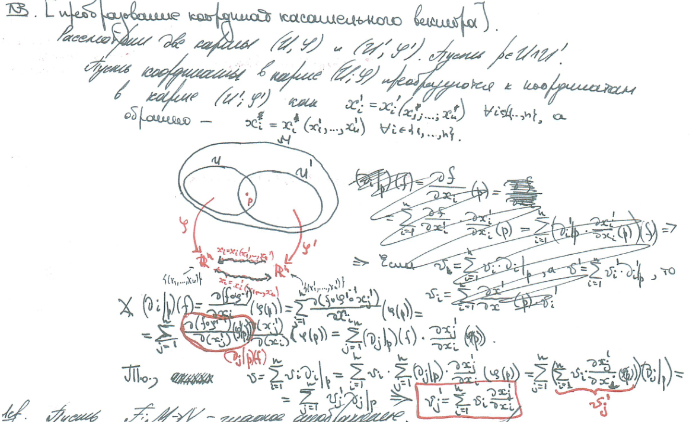

- Overall:
	- Есть куски для работы с многообразиями (и всеми компонентами из диффгеомы), есть конкретно под tasks, есть под оптимизации вычислений (которые пока не рассматриваю).
	- Очень активно перегружаются методы, поэтому надо внимательно смотреть на аргументы.
	- `pe` обозначает точку на самом многообразии (как бы e-embedded), `p` --- точка в карте.
	- Везде `chart` --- это локальное представление в карте, `emb` --- явное положение в многообразии (условно вложенно).
		- Соответственно, например, `chart_to_emb` обозначает отображение из карты в многообразие $\varphi^{-1}$.
	-
		-
-
- `manifolds.jl` --- дефолтные определения методов для работы с многообразиями. Использует внутри методы, которые должны быть определены под конкретные многообразия.
	- `chart_transition(p1, C1::Chart{I,M}, C2::Chart{J,M})` --- переход между картами aka $\varphi^{-1} \circ \psi$. Есть перегрузка под касательные расслоения
	- `chart_to_emb_differential(x, v, C::Chart{I,M})` / `emb_to_chart_differential(xe, ve, C::Chart{I,M})`--- видимо, просто то же самое, что `chart_to_emb` / `emb_to_chart`, только добавляет пересчет касательного вектора
	  id:: 67d57af1-71ef-4ee1-a54a-bc6628210c60
	- `chart_to_emb_differential(x, v, a, C::Chart{I,M})` / `emb_to_chart_differential(xe, ve, ae, C::Chart{I,M})`--- вроде то же самое, но еще для преобразования ускорений
	- `chart_transition_differential(x1, v1, C1::Chart{I,M}, C2::Chart{J,M})` --- преобразование координат при переходе между картами 
	-
-