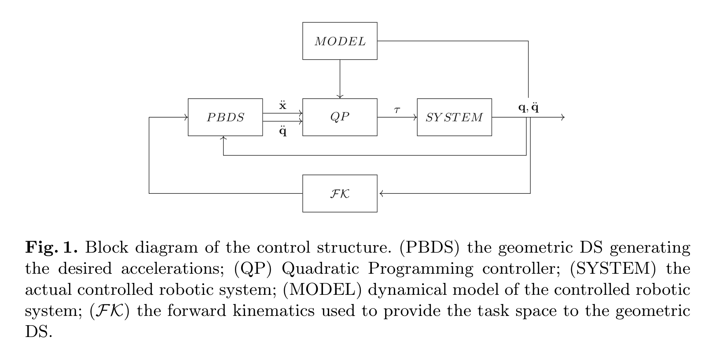
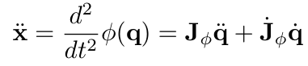

filters:: {"источники" false}

- {{embed [[@Hybrid Quadratic Programming - Pullback Bundle Dynamical Systems Control]]}}
- # #Заметки
	- В введении говорится про [[Статья RMP]]:
	  > However, correctly designing metrics to account for such deformation directly in the configuration manifold can be dififcult. The same applies for scenarios where multiple goals have to be taken into consideration.
	  
	  То есть про проблему задания метрик (про что говорится и в [[Диссертация Биллард]], и что они пытаются подправить), но также про вопрос создания нескольких целей.
		- В случае нескольких целей будет несколько аттракторов, которые все-таки могут образовать локальный минимум. А значит каждый раз нужно проверять (задавать таким образом) возможность локальных минимумов.
			- Несколько слов про это есть в [[Диссертация Биллард/2.8 Robot Arm Experiments]]
			  > Note that although in this state we have multiple potentials, one for each attractor task, they are easily designed to be always non-conflicting (i.e., the inner product of their resulting desired robot accelerations is never negative), and thus they produce no undesirable local minima.
	- Также про [[Статья RMP]] 
	  > One of the main limitations of the this approach is the lack of geometric consistency. This translates in a control law that yields different output depending on the particular representation of a certain manifold structure.
		- Именно про это вопрос
		  {{embed ((67a25034-aa66-4966-af4f-15da00516f19))}}
	- Предлагаемый результат статьи:
	  > In this paper, we propose a hybrid Quadratic Programming Pullback Bundle Dynamical System yielding the following advantages: 1) torque-based control for compliant and adaptive motions; 2) model based approach for dynamical consistent motion.
		- Получается переход от управление ускорениями к моментам и учтение структуры робота при движении --- звучит как полезные улучшения.
	- Предложенная схема работы
	  
		- То есть результаты выхода  с PBDS (ускорения) подаются на блок, который, получая также информацию с динамической модели робота, обеспечивает преобразование в моменты.
	- Внутри условия
	  $$C_I \mathbf{z} + c_I \geqslant 0$$
	  заложены ограничения сочленений по скорости, ускорению и моменту.
- # #Вопросы
	- Заявлено, что 
	  > If the Jacobian, J, is injective everywhere, the solution of Eq. 3 can be recovered via least mean square as an analytical solution to the optimization problem $\min_{\ddot{q}} \|J\ddot{q} - b\|^2$.
	  
	  То есть опять какие-то ограничения на якобиан, про которые пока непонятно: когда они удовлетворяются и что делать, если этого нет?
- # #Мысли
	- Я так понимаю, что предлагают не все задачи отдавать PBDS, а что-то оставлять на свойства динамической системы. К примеру, ограничения на сочленения вместо задавания их сферами и включения в один из тасков PBDS.
	- То есть внутри блока `QP` решается задача квадратичной оптимизации, в которой мы стремимся найти такие $\ddot{q}$ и $\tau$, что $\ddot{q}$ оказалось близко к выходу PBDS, а $\tau$ оказался достаточно маленьким моментом.
	- Также внутри похоже решается задача обратной кинематики, так как в условие
	  $$C_E \mathbf{z} + c_E = 0 \qquad (5)$$
	  зашито выражение $J\ddot{q} + \ddot{x}_d - \dot{J} \dot{q} + \mathcal{slack}$, которое и передает поиск ускорения в конфигурационном пространстве $\ddot{q}$, соответствующего желаемому ускорению в операционном пространстве $\ddot{x}_d$.
	  {:height 52, :width 201}
		- Вот только знак чуть не совпадает, но надо посмотреть, в чем разница (или просто где-то потерял минус).
- # #Выводы
-
-